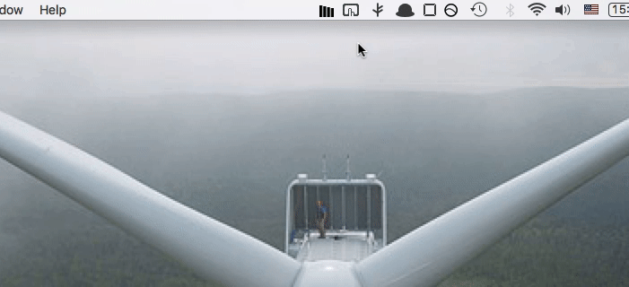

# KEXP Menu Bar

 

	

<h3 align=center>Where the music matters... in your menu bar.</h3>

 

	

Icon animation can be turned off in settings.

 

<h3>play/pause - left click</h3>
<h3>info - right click</h3>

 
 

<h3 align=center>
	<b><a href="https://github.com/NoneOfMaster/kexp-menu-bar/raw/main/release/KEXP%20Menu%20Bar-1.0.0.dmg">Download</a></b>
</h3> 

(macOS only)

 
 
 

<i>Disclaimer: I am not affiliated with KEXP other than as a long-time listener and grateful [amplifier](https://www.kexp.org/donor-lounge/ways-give/make-recurring-monthly-donation-amplifiers-club/).</i>
